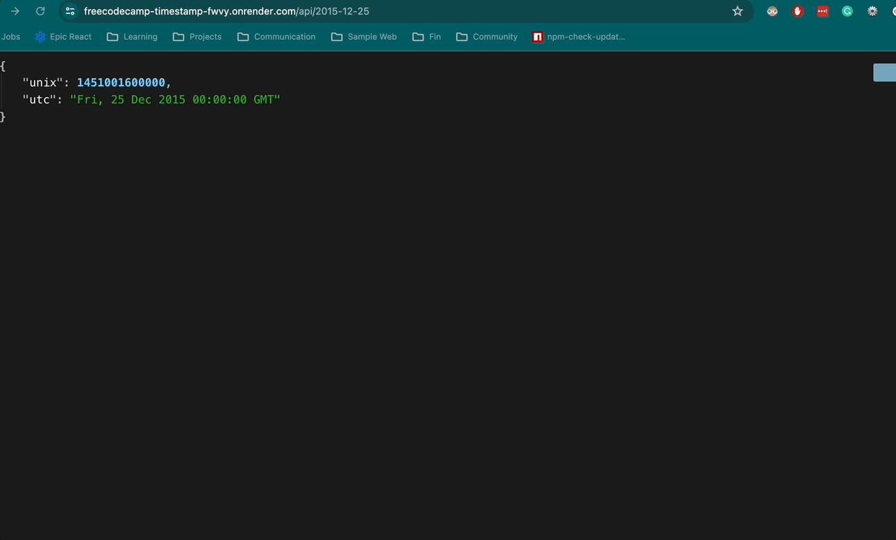

# Timestamp

freeCodeCamp - Back End Development and APIs | Project: Timestamp

# Summary

Create a timestamp api that will take in route params. A request to /api/:date? with a valid date should return a JSON object with a unix key that is a Unix timestamp of the input date in milliseconds (as type Number) and a utc key that is a string of the input date in the format: Thu, 01 Jan 1970 00:00:00 GMT.
**[Learn more about the Project Task.](https://www.freecodecamp.org/learn/back-end-development-and-apis/back-end-development-and-apis-projects/timestamp-microservice)**

The route params are the following:

-   A unix timestamp like 1451001600000
-   A string such as 2015-12-25 or 05 October 2011, GMT
-   The route params can also be invalid date inputs such as a string like this this-is-not-a-date
-   An empty route parameter should return the current time and date in a JSON object with a unix and utc key

### Implementation

-   Use momentjs isValid function to check if the dateInput is a valid date
-   Created a TypeScript + Express API
-   Used `Map` to easily create objects and convert the `Map` into an object
-   Created a ` util.ts`` file to place all the helper functions used in the  `server.ts` file
-   Used [Date.getTime()](https://developer.mozilla.org/en-US/docs/Web/JavaScript/Reference/Global_Objects/Date/getTime) to return the number of milliseconds for this date since the epoch
-   Used [Date.toUTCString()](https://developer.mozilla.org/en-US/docs/Web/JavaScript/Reference/Global_Objects/Date/toUTCString) to return a string representing this date in the RFC 7231 format, with negative years allowed

### Demo

# Technologies:

-   JavaScript
-   TypeScript
-   Render
-   momentjs
